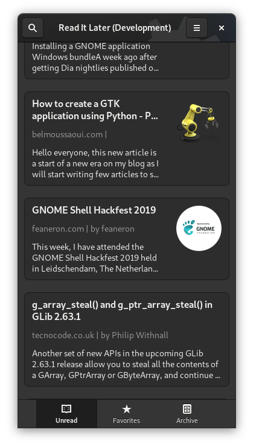
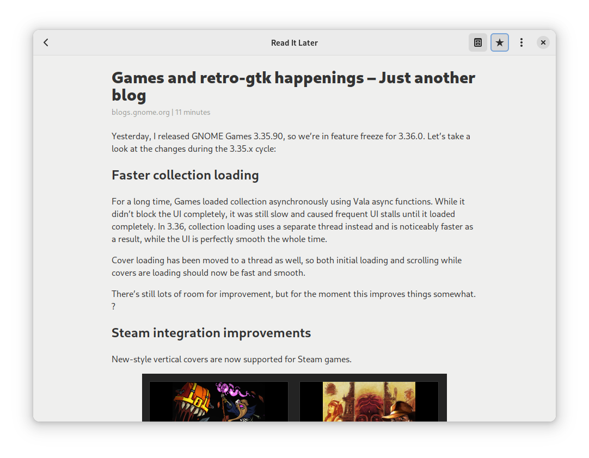

# Read It Later (WIP)

A Wallabag frontend using GTK & Rust

## Screenshots

## Hack on Read It Later
To build the development version of Contrast and hack on the code
see the [general guide](https://wiki.gnome.org/Newcomers/BuildProject)
for building GNOME apps with Flatpak and GNOME Builder.

You are expected to follow our [Code of Conduct](/code-of-conduct.md) when participating in project
spaces.
