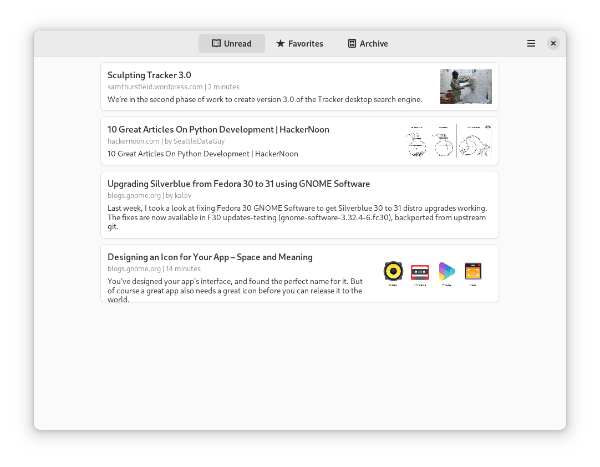

# Read It Later

A Wallabag Client

## Screenshots

## Hack on Read It Later
To build the development version of Read It Later and hack on the code
see the [general guide](https://wiki.gnome.org/Newcomers/BuildProject)
for building GNOME apps with Flatpak and GNOME Builder.

You are expected to follow our [Code of Conduct](https://wiki.gnome.org/Foundation/CodeOfConduct) when participating in project
spaces.
